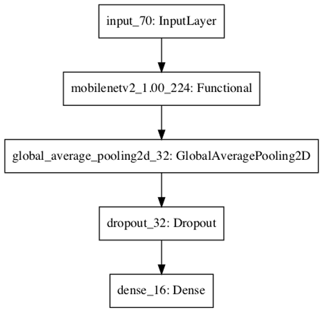

# Detection of Lymph Node Metastases in Women With Breast Cancer

## Overview

This repository contains a solution to the [CAMELYON16](https://camelyon16.grand-challenge.org/Home/) challenge. The goal of this challenge is to develop an algorithm to detect cancer in digital slides of lymph node tissue.

## Motivation

To detect the presence of cancer on a slide containing lymph node tissue, a pathologist must spend a great deal of time analyzing the specimen under a microscope. This task is time consuming and subject to human error. With advancements in deep learning, an automated solution could be developed to analyze slides more efficiently and objectively. 

## Medical Background

Lymph node metastases occur in most cancer types (e.g. breast, prostate, colon). Lymph nodes are small glands that filter lymph, the fluid that circulates through the lymphatic system. The lymph nodes in the underarm are the first place breast cancer is likely to spread. Analyzing the tissue of the lymph node can therefore be used to detect breast cancer[.](https://camelyon16.grand-challenge.org/Background/) 

<p align="center"></p>

## Data

- The data for the challenge consists of high resolution slides of tissue. Some slides are as detailed as 100,000 X 100,000 pixels.
<p align="center"></p>

## Data Creation
- A script extracts 299X299 patches from a given slide.
<p align="center">  </p>

-	The logic for extracting patches is as follows:

    1. Iterate through the slide in 299 pixel strides
    2. Extract a 299X299 patch
    3. If the patch is mostly grey, skip it (as it is likely a section of the slide that is not tissue)
    4. If the center 128X128 pixels are X% cancerous, label as cancerous, otherwise, label as safe

- I created 3 datasets with X values of 10, 30, and 50 percent.

## Models

- All of the models in this repository are convolutional neural networks built using Tensorflow. 
- They all involve transfer learning on top of Mobilnetv2.
- I chose Mobilnetv2 because of its small size and efficientcy when training. Each model was trained on tens of thousands of images and therefore, speed was essential if I wanted to test with many different architiectures and datasets.

### Base Model

- The base model was built on top of Mobilnetv2 and addtionally included a GlobalAveragePooling2D layer, a Dropout(.2) layer and a Dense layer.
- It was trained using early stopping on valiudation loss for 30 epochs.
- It was trained on 3 datsets with X% values of 10, 30, and 50 percent.

<p align="center"></p>


### Example Slide 

### Markdown

Markdown is a lightweight and easy-to-use syntax for styling your writing. It includes conventions for

```markdown
Syntax highlighted code block

# Header 1
## Header 2
### Header 3

- Bulleted
- List

1. Numbered
2. List

**Bold** and _Italic_ and `Code` text

[Link](url) and 
```


