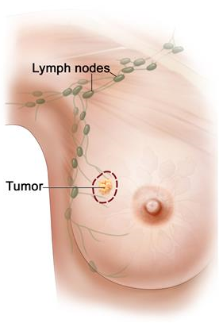

## Overview

This repository contains a solution to the [CAMELYON16](https://camelyon16.grand-challenge.org/Home/) challenge. The goal of this challenge is to develop an algorithm to detect cancer in digital slides of lymph node tissue.

## Motivation

To detect the presence of cancer on a slide containing lymph node tissue, a pathologist must spend a great deal of time analyzing the specimen under a microscope. This task is time consuming and subject to human error. With advancements in deep learning, an automated solution could be developed to analyze slides more efficiently and objectively. 

## Medical Background

Lymph node metastases occur in most cancer types (e.g. breast, prostate, colon). Lymph nodes are small glands that filter lymph, the fluid that circulates through the lymphatic system. The lymph nodes in the underarm are the first place breast cancer is likely to spread. Analyzing the tissue of the lymph node can therefore be used to detect breast cancer. [(source)](https://camelyon16.grand-challenge.org/Background/) 

## Data

- The data for the challenge consists of high resolution slides of tissue. Some slides are as detailed as 100,000 X 100,000 pixels.

## Data Creation
- A script extracts 299X299 patches from a given slide.

-	The logic for extracting patches is as follows:

    1. Iterate through the slide in 299 pixel strides
    2. Extract a 299X299 patch
    3. If the patch is mostly grey, skip it (as it is likely a section of the slide that is not tissue)
    4. If the center 128X128 pixels are X% cancerous, label as cancerous, otherwise, label as safe

- I created 3 datasets with X values of 10, 30, and 50 percent.

## Models

- All of the models in this repository are convolutional neural networks built using Tensorflow. 
- They all involve transfer learning on top of Mobilnetv2.
- I chose Mobilnetv2 because of its small size and efficiency when training. Each model was trained on tens of thousands of images and therefore, speed was essential if I wanted to test with many different architectures and datasets.

### Base Model

- The base model was built on top of Mobilnetv2 and additionally included a GlobalAveragePooling2D layer, a Dropout(.2) layer and a Dense layer.

### Base Model + Data Augmentation

- Includes a data augmentation layer on top of the base model.

      data_augmentation = tf.keras.Sequential([ 
        tf.keras.layers.experimental.preprocessing.RandomFlip(), 
        tf.keras.layers.experimental.preprocessing.RandomRotation(0.25)
      ])     

### Fine-tuned Base Model

- The top 10 layers of mobilnetv2 within my best base model are set to trainable.

### 2-Zoom Model

- Takes as input two 299X299 patches at different resolutions.
- Both patches have the same center, with the lower resolution patch (below on the left) covering more area. 

    
    

- Each patch is fed to a base model (from above) and the results are then concatenated and passed to a single node dense layer.

## Training
- All models were trained using early stopping on validation loss for 30 epochs.
- All models were trained on 3 datasets with X% values of 10, 30, and 50 percent.

## Results
- The best performing model was the fined-tuned Mobilnetv2 model without data augmentation, trained on a dateset with a cancer threshold (X%) of 30%.
- Below are two examples of how the model performed on an entire slide. 
    - In order to test an entire slide, the slide is divided into 299X299 patches, each patch is fed into the model, and the results from all of those patches are combined into a 2D heatmap. 
    - In the examples below, the image on the left is the ground truth and the image on the right is the model's prediction. 

## Future Work

- Build a custom model that does not use transfer learning and contains fewer parameters. 
- Utilize the cloud to train with more data.
- Attempt coloring data augmentations.

## Files

- main.ipynb
    - Contains all of the code for data exploration, data creation, dataset creation, model building, model training, and model evaluation. It is full of comments, explanations, and graphs/charts.
- /Demo/demo_script.ipynb
    - Contains a script for evaluating an entire slide using the best model. Instructions are at the top of the file.
